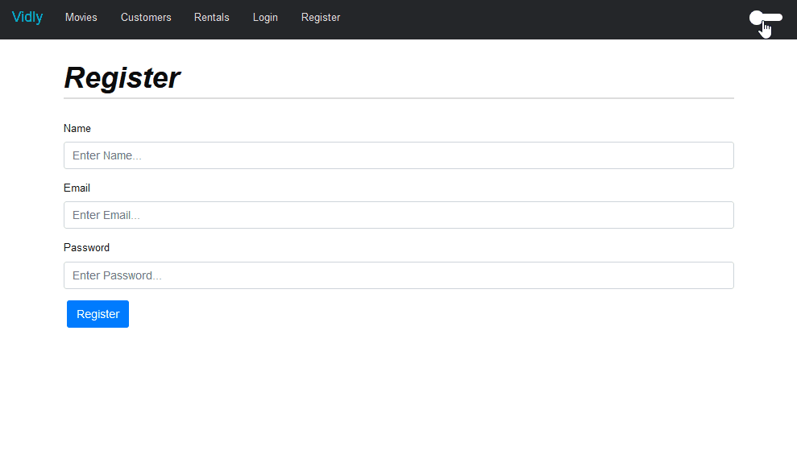

# Vidly-TS - Movie Rental Plataform

# Objectives

The main objective of this project is to convert an client APP built using React-Javascript-Bootstrap to an APP using React-Typescript-SCSS. The idea is to deal with the challanges of the conversion, focusing on the tecnologies istead of the bussiness rules and solutions that the App will delivery.

The backend can be found at https://github.com/luanpersini/vidly-server-ts

**From:**

- React 16 (using classes, mount/dimount)
- Javascript (no types)
- Bootstrap 4 (styles library)

**To:**

- React 17 (using functions and hooks)
- Typescript (strongly typed)
- styled components + bootstrap (gonna keep bootstrap because the goal is to learn how to use styled components)

## Vidly

Vidly is a movie rent plataform where you can manage movies, customers, rents and genres. Authentication and authorization is present and all data is consumed from an external API, build in nodejs. 

## DevTecnologies

- Eslint
- Husky
- Git Commit Msg Linter
- Jest

## What was archieve so far - challanges

The challanges were really present. Many research had to be done to convert from react 16 to react 17. Using useState and useEffect with objects comparsion imposed a good challange, because they become different every time a render occur.

**Archievements:**

- Made a single File to handle routes, mapping it inside App.tsx.
- Implemented an abstraction to http calls (AxiosHttpAdapter)
- Used a decorator to intercept unexpected errors from http service.
- Implemented a Log Service using a Decorator to intercept unexpected errors from http calls. (log-http-decorator)  
- Made a helper to handle http responses, resolving expected errors (forbidden, notFound, etc) with the possibility of using Toast Messages.
- Implemented an abstraction to validate schemas (YupAdapter)
- Implemented a dinamic route system.
- Made a component to check if the user is autenticated to access restricted routes (ProtectedRoute)
- Implemented a Theme selector (Dark/Light) with styled components. 

**Credits:**
The original app was build by Mosh. You can find his courses at: https://codewithmosh.com/

